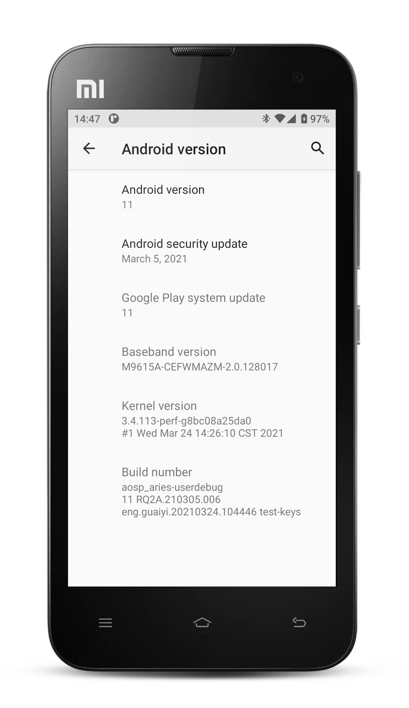

Local manifests to build AOSP for Xiaomi Mi2.

How to build:
-------------

Initialize repo:

    repo init -u https://android.googlesource.com/platform/manifest -b android-11.0.0_r32
    curl --create-dirs -L -o .repo/local_manifests/local_manifest.xml -O -L https://github.com/tiger-cave/local_manifests/raw/android-11.0/local_manifest.xml
    repo sync

Compile:

    . build/envsetup.sh
    lunch aosp_aries-userdebug
    make -jX otapackage

